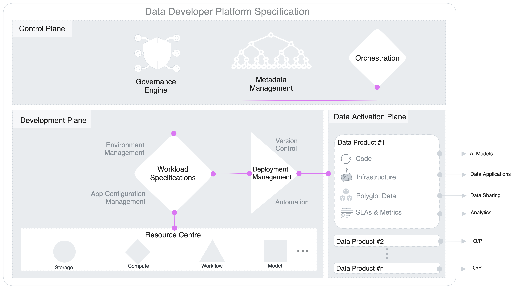
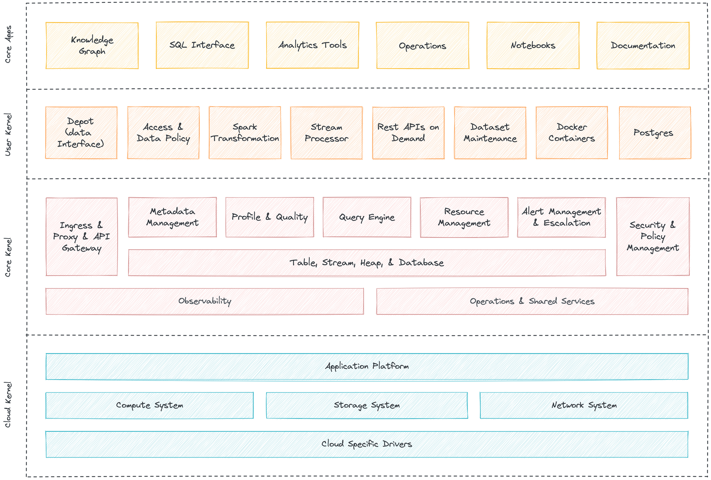
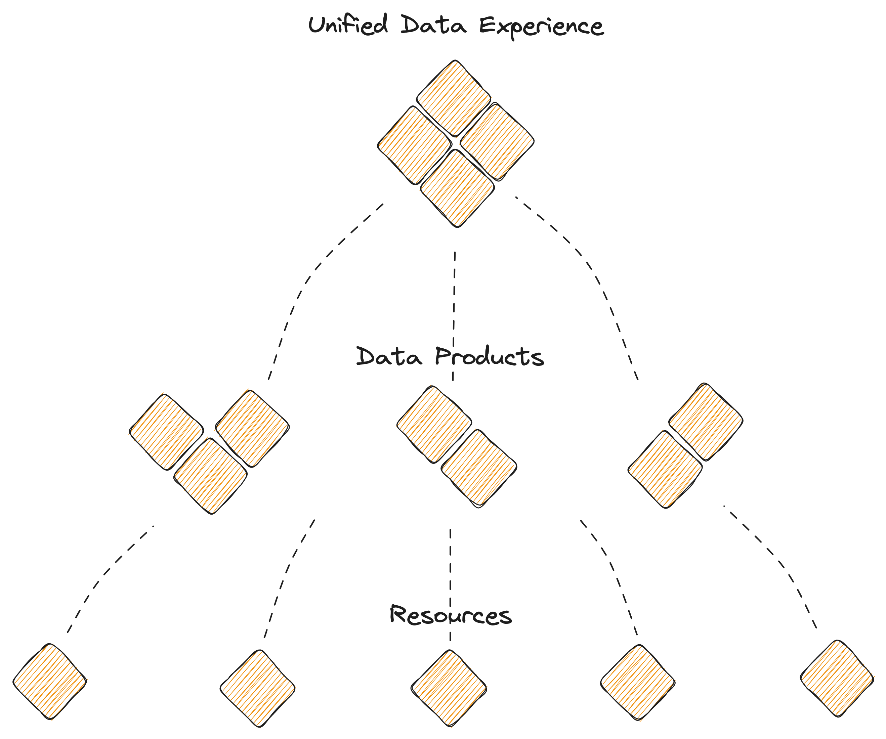

## Architecture

## Conceptual Architecture: The Trifecta

DDP allow users to operationalise the platform through a triple-plane conceptual architecture where the control is forked between one central plane for core universal components, one or more development planes for workload management, and one or more data activation planes for localised or domain-specific deployment.

Control & Data plane separation decouples the governance and execution of data applications. This gives the flexibility to run the DDP in a hybrid environment and deploy a multi-tenant data architecture. Organizations can manage cloud storage and compute instances with a centralised control plane.

### Control Plane

The Control Plane helps admins govern the data ecosystem through centralised management and control of vertical components.

- Policy-based and purpose-driven access control of various touchpoints in cloud-native environments, with precedence to local ownership.
- Orchestration of data workloads, compute cluster life-cycle management, and version control of a Data Operating System’s resources.
- Metadata management of different types of data assets.

### Development Plane

The Development plane helps data developers, specifically data engineers, to create workload specifications for data products and data applications. 

- Single specification file to manage end-to-end workloads for data products and applications
- Resource hub available for elastic provisioning
- Declarative environment and application configuration management
- Automated and version-controlled deployment

### Data Activation Plane

The Data Plane helps data developers to deploy, manage and scale data products.

- Federated SQL query engine.
- Declarative stack to ingest, process, and extensively syndicate data.
- Complex event processing engine for stateful computations over data streams.
- Declarative DevOps SDK to publish data products and apps in production.

### Integrating the Planes

#### **Integrating Control and Development Planes**

The control plane takes the lead on universal jobs, such as metadata management, governance, and orchestration. The orchestrator in the control plane consumes instructions from the specification file in the development plane and triggers the infrastructure by provisioning and de-provisioning resources and executing the required runs. For every trigger, the orchestrator checks in with the governance engine to validate policy execution and logs metadata with the metadata engine.

#### **Integrating Development and Data Activation Planes**

The specification generated in the development plane is deployed and run on the data activation plane. While the resources are arranged in the development plane, they are executed in the activation plane, where the actual operations on data take place. Ideally, a single specification file in the development plane has a 1:1 relationship with a data product in the data activation plane, but this is not necessarily the norm. Developers can also build and trigger a config file with multiple data product references to target a specific use case.

#### **Integrating Control and Data Activation Planes**

The orchestrator in the control plane is the heart of the DDP and ensures the resources in the specification (from the development plane) are executed in the right order in the data activation plane. For every operation on data, the orchestrator checks in with the governance engine to validate access and masking policies on the data. Every operation also generates tons of metadata which get logged into a database through the metadata engine.

## Technical Architecture: Multilayered Kernel

DOS is enabled through a multilayered kernel architecture that allows dedicated platform engineering teams to operate the system’s core primitives without affecting the business or application user’s day-to-day operations. Like the kernel of any operating system, it facilitates communications between users and primitives of the data operating system on the one hand and the binary world of the machines on the other. Each layer is an abstraction that translates low level-APIs into high level-APIs for usage by the different layers, components, or users of a Data Operating System. The kernels can logically be separated into three layers.

The layered architecture promotes a unified experience as opposed to the complexity overheads of a microservices architecture imposed by the modern data stack. While the microservices architecture has some benefits, it also comes with performance, maintenance, security, and expertise overheads that can ultimately cost the organisation low ROI on data teams and high time to ROI for data applications. On the other hand, the layered approach promotes a loosely coupled yet tightly integrated set of components to disband the disadvantages of the modern data stack.

#### Cloud Kernel

Cloud Kernel makes it possible for a Data Operating System to work with multiple cloud platforms without requiring specific integrations for each one. The Data Operating System uses several custom-built operators to abstract the VMs and network systems provisioned by the cloud provider. This allows users to not worry about the underlying protocols of the cloud provider and only communicate with the high-level APIs provided by the cloud kernel, making DOS truly cloud-agnostic.

#### Core Kernel

Core Kernel provides another degree of abstraction by further translating the APIs of the cloud kernel into higher-order functions. From a user’s perspective, the core kernel is where the activities like resource allocation, orchestration of primitives, scheduling, and database management occur. The cluster and compute that you need to carry out processes are declared here; the core kernel then communicates with the cloud kernel on your behalf to provision the requisite VMs or node pools and pods.

#### User Kernel

User kernel is the third layer of abstraction over the APIs of the core and cloud kernels. The secondary extension points and programming paradigms of the Data Operating System, like the various Stacks and certain Primitives, can be envisioned to be working at this level. While you can directly communicate with the cloud kernel APIs, as a user of the Data Operating System, you can choose to rather work with the core and user kernels alone. The core kernel is where users work with essential features like Security, Metadata Management, and Resource Orchestration. In contrast, the user kernel can be thought of as the layer where the users have complete flexibility in terms of which components or primitives they want to leverage and which they do not require.

## Structural Architecture: Hierarchical Model

> “Complex subsystems can evolve from simple systems only if there are stable intermediate forms. That may explain why hierarchies are so common in the systems nature presents to us among all possible complex forms. They reduce the amount of information that any part of the system has to keep track of.” ~ *Donella H. Meadows, author of **Thinking in Systems***
> 

Even Amazon identified this necessary hierarchical pivot right before AWS became the Operating System for Developers to build applications. We can get a clear picture of that from a published interview with one of the core members of AWS.

> “If you believe developers will build applications from scratch using web services as **primitive building blocks**, then the operating system becomes the Internet,” says Jassy (AWS Leader and SVP) — an approach to development that had not yet been considered. Amazon asked itself what the **key components of that operating system would be**, what already existed, and what Amazon could contribute.” ~ *Andy Jassy, SVP and Leader @AWS*
> 

How about considering a pivot for the Data Landscape in the same spirit?

- The Hierarchical Infrastructure design is the fundamental need for scalable systems.
- A composable set of resources - fundamental atomic building blocks and the means to quick pivots into variant higher-order frameworks or data design architectures such as meshes and fabrics.
- A fundamental systems thinking approach to reap value from frequent and disruptive innovations without having to rip and replace months and years of hard work and investments- too common in the data landscape.
- Evolving the organisation’s data stack with complete ownership and control into higher-order frameworks (and innovations) instead of rupturing under the weight of rapid disruption.

Modularisation is possible through a finite set of resources that have been uniquely identified as essential to the data ecosystem. These resources are distributed across the kernel layers to enable first, second, and multi-degree components that facilitate low-level operations and complex use-case-specific applications.

The Data Developer Platform, technically defined, is a finite set of unique resources that talk to each other to declaratively enable any and every operation that data users, generators, or operators require- just like a common set of core building blocks or Lego pieces that can be put together to construct anything, be it a house, a car, or any other object. DDP core resources can similarly be put together to construct or deconstruct any data application that helps data developers serve and improve actual business value instead of investing their time and effort in the complex processes behind those outcomes.

> With the hierarchical design, 
→ DDP puts together stable subassemblies of fundamental first-order solutions (resources)
→ Builds second-order solutions on top of the common layer of atomic solutions (data products)
→ Continues to traverse n-times for n-order problems (mesh, fabric, data apps, etc.)
> 

Therefore, when something faults in a DDP, every n-order solution only loses part of its capability, and the data developer:

- Does not need to relearn unique philosophies and languages for every higher-order solution
- Have a common lineage of (n-m)-order solutions to rollback on (m≥n)
- Does not need to undertake integration overheads given (n-m)-order solutions declaratively interoperate
- Rollout non-disruptive changes across all orders through dynamic configuration management

Resources are atomic and logical units with their own life cycle, which can be composed together and also with other components and stacks to act as the building block of the Data Developer. Platform. They can be treated as artefacts that could be source-controlled and managed using a version control system. Every resource can be thought of as an abstraction that allows you to enumerate specific goals and outcomes in a declarative manner instead of the arduous process of defining ‘how to reach those outcomes’.

DDP Resources or building blocks:
 
* **Workflow**: *Workflow is a manifestation of DAGs that streamlines and automates big data tasks. DOS uses it for managing both batch and streaming data ingestion and processing.*

* **Service**: *Service is a long-running process that is receiving and/or serving APIs for real-time data, such as event processing and stock trades. It gathers, processes, and scrutinises streaming data for quick reactions.*
  
* **Policy**: *The policy regulates behaviour in a Data Operating System. Access policies control individuals, while data policies control the rules for data integrity, security, quality, and use during its lifecycle and state change.*

* **Depot**: *Depot offers a uniform way to connect to various data sources, simplifying the process by abstracting the various protocols and complexities of the source systems into a common taxonomy and route.*
  
* **Cluster**: *A cluster is a collection of computation resources and configurations on which you run data engineering, data science, and analytics workloads. A Cluster is provisioned for exploratory, querying, and ad-hoc analytics workloads.*
  
* **Secret**: *Secret store sensitive information like passwords, tokens, or keys. Users access it with a ‘Secret’ instead of using sensitive information. This lets you monitor and control access while reducing data leak risks.*

* **Database**: *Database resource is for the use cases where output is saved in a specific format. This resource can be used in all scenarios where you need to syndicate structured data. Once you create a Database, you can put a depot & service on top of it to serve data instantly.*
  
* **Compute**: *Compute resources are the processing power required by any workflow/service or query workload to carry out tasks. Compute is related to common server components, such as CPUs and RAM. So a physical server within a cluster would be considered a compute resource, as it may have multiple CPUs and gigabytes of RAM.*

* **Operator**: *Operator registers resources that are not native to DDP and enables the orchestrator in the control to identify and orchestrate these resources. The operator resources make DDP truly extensible and customisable.*
  
* **Bundle**: *Bundle, as the name suggests, is a collection of several resources coming together to form an isolated branch in the DDP.  A bundle can define the instructions for enabling the specifications of a data product or a data application.*

 
 

## Extensible Architecture: Workshop for Higher-Order Architectures

The flexible or composable infrastructure of the DDP allows it to become the foundation for any data design architecture an organisation chooses. The rearrangeable set of finite primitives enables users to declaratively trigger the necessary golden paths to interoperate and establish complex architectures.

DDP, therefore, can enable specific data design architectures with just a few degrees of rearrangement. Given it is also a self-service platform for data developers, including data engineers and data architects, setting up these frameworks is even more low-effort-high-impact. Architects don’t have to reinvent the wheel and ideate from scratch. Instead, they already have their first-order capabilities, such as storage, compute, cluster, and others ready on an easily consumable plane. All they need to do is rearrange these blocks to enable their data strategies.
