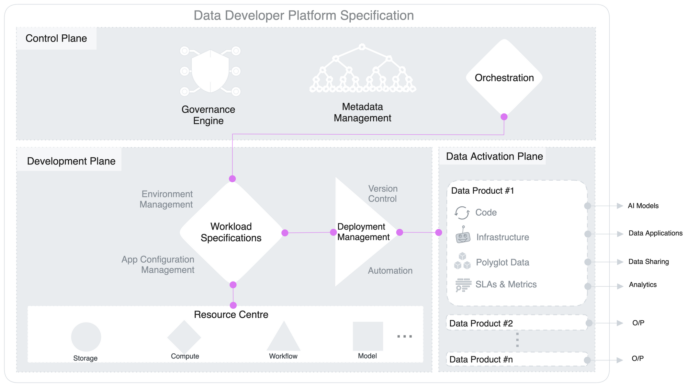

## DDP Capabilities

## DDP Core Capabilities

1. **Configuration Management**
    
    Advanced management of configurations for fine-tuning Data Products, allowing data developers to adjust settings and parameters dynamically.
    
2. **Infrastructure Orchestration**
    
    Automating and optimising underlying infrastructure resources, such as computing and storage, to support the demanding data processing and analytics requirements.
    
3. **Environment Management**
    
    Comprehensive management of development, testing, and production environments tailored to data workflows, ensuring controlled and efficient data product development.
    
4. **Deployment Management**
    
    Streamlined packaging, deployment, versioning, and release management processes for Data Products, enabling efficient and consistent deployment across various environments.
    
5. **Attribute-Based Access Control**
    
    Granular access control mechanisms, based on attributes, regulate permissions and ensure secure access to data resources within the Data Products.
    

## Capabilities in the Interest of Data Personas

### Data Developer

Responsible for building, deploying, monitoring, and scaling Data Products, aka Data Engineers, AI/ML Engineers.

- **Flexibility:** DDP provides data developers with a flexible and modular environment, allowing them to choose the best tools, frameworks, and resources to build, deploy, and scale their data products.
- **Modularity and Extensibility:** DDP offers a set of standardised resources and design patterns that enable data developers to easily compose and extend their data solutions, promoting code reuse and accelerating development cycles.
- **Streamlined Deployment and Monitoring:** DDP automates and streamlines the deployment and monitoring processes, enabling data developers to quickly iterate on their data products and ensure their optimal performance and reliability.
- **Declarative Freedom; Scalability:** DDP provides the necessary infrastructure and tools to scale data products efficiently, handling increasing data volumes, processing demands, and user traffic. Data developer can declaratively build data pipelines and has more time to focus on spinning up applications and deploying them to produce tangible impact on the business ROI.

### Operator

Responsible for infrastructure orchestration, deployment management, and ensuring data governance and security within the platform

- **Ecosystem Management:** DDP facilitates the management of the data development ecosystem by providing centralized control and governance mechanisms. DDP operators can easily integrate and manage various tools, technologies, and services, ensuring seamless collaboration and interoperability.
- **Simplified DevOps:** DDP enables operators to implement streamlined DevOps practices specific to data development. It automates infrastructure provisioning, configuration management, and deployment processes, reducing operational complexities and enabling faster time-to-market.
- **Security and Compliance:** DDP includes robust security and compliance features, allowing DDP operators to enforce access controls, data protection measures, and privacy regulations. It ensures that data products and associated processes adhere to organisational and regulatory requirements.

### Data Developers in Action

Personas across DDP’s three planes and their primary task(s) in each plane.

| DDP Plane | Primary Persona | Secondary Persona | Tertiary Persona |
| --- | --- | --- | --- |
| Control Plane | Platform Engineer (Orchestration health) | Operator (Governance) | Data Engineer (Metadata insights) |
| Development Plane | Data Engineer (Declarative specs) | Platform Engineer (Resource health, Extensibility) | Operator (DevOps, Supervision) |
| Data Activation Plane | Data Engineer (App development) | Data Producer & Consumer (Data generation & consumption) | Operator (DevOps, Supervision) |

## Workflow: Data Product Development

Baseline: The three planes are pre-connected in DDP, so data developers are not required to integrate the capabilities across these planes.

1. Leverage DDP’s config templates to bundle resources into an isolated instance of infrastructure for a data product.
2. Declare deployment environment and variables.
3. Create and publish policies as per the domain.
4. Deploy the data product.
5. Build one or more data applications that consume the data product.