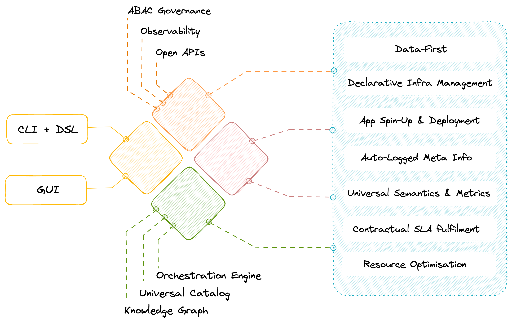

# The Essence of Having Your Own Data Developer Platform
> DDP value in context of data design patterns, fundamental principles, and core philosophies

Moving to a Data Developer Platform (DDP) is not just another tooling shift or migration activity. While it is almost as simple as the former and not as challenging as the latter, the context of such a shift is entirely different.

Enabling a data developer platform is essentially a pivot in your data philosophy. Everything from how you approach and ingest data to how you understand and operationalise it undergoes a major transformation.

I’m glad to collaborate with Travis Thompson, the Chief Architect of the Data Operating System, on this piece. Travis has designed state-of-the-art architectures and solutions for top organisations, the likes of GAP, Iterative, MuleSoft, HP, and more. With over 30 years of experience in all things data and engineering, he is one expert you could spend hours listening to and learning from!

In this article, we have shared the philosophy of a Data Developer Platform and why it is an essential future-proofing kit in the rapidly changing technical landscape of data.

But first, boring introductions.

## What is a Data Developer Platform?
A Data Developer Platform can be thought of as an internal developer platform for data engineers and data scientists. Just as an internal developer platform provides a set of tools and services to help developers build and deploy applications more easily, a data developer platform provides a set of tools and services to help data professionals manage and analyze data more effectively.

An internal data platform typically includes tools for data integration, processing, storage, and analysis, as well as governance and security features to ensure that data is managed, compliant and secure. The platform may also provide a set of APIs and SDKs to enable developers to build custom applications and services on top of the platform.

In analogy to the internal developer platform, a data developer platform is designed to provide data professionals with a set of building blocks that they can use to build data products and services more quickly and efficiently. By providing a unified and standardised platform for managing data, an internal data platform can help organizations make better use of their data assets and drive business value.

## Conceptual Philosophy of a Data Developer Platform
This is where the DDP story finds its spark. A data developer platform’s philosophy is a direct parallel of the Operating System philosophy. Yes, the idea that literally changed the world by giving encapsulated technology into the hands of the masses.

While a gamer uses a Mac to run games, an accountant uses the same machine to process heavy Excel files. While a musician uses a phone to create complex media files, a grandparent uses it to video call the grandkids.

> Same platform. Different use cases.

> Same infrastructure. Variety of simple and complex solutions.

In all cases, neither of the users needs to understand the low-level technology or build their applications from scratch to start using the applications for their desired outcomes. But does that mean there’s no one on the other end figuring out the infrastructure complexities of the laptops, PCs, and phones?

There indeed is a very small (compared to the size of the user base) team behind infrastructure building and maintenance, and their job is to ensure all the users on the other side have a seamless experience without the need to get into the nitty-gritty. If the infrastructure is well-kept, users are abstracted from the pains of booting, maintaining, and running the low-level nuances of day-to-day applications that directly bring them value.

So is the case with a well-designed data developer platform. While smaller dedicated platform teams manage and regulate the infrastructure, larger teams of data developers are able to focus their time and effort on building data applications instead of worrying about plumbing issues. Applications across a broad range, including AI/ML, data sharing, and analytics, are all enabled at scale through the virtue of the same philosophy.

With a DDP in place, the data developer is essentially abstracted from all the low-lying details- all now delegated to the unified infrastructure of the DDP. The only job of the data developer now is to build and enable data applications that directly power business value. And while the infrastructure takes care of the resources, environments, provisioning, and supervisory activities, a small dedicated platform team ensures that the infra is healthy and ready to do its job.

## Outcome of a Data Developer Platform
A data developer platform is a flexible base and allows users to materialise desired solutions or a plethora of data design patterns on top of it. We will attempt to explain the flexibility through a concept that most of you might relate to: The Data Product construct.

The idea of “Data Products” holds significant deep-seated value since it enwraps key pillars of data robustness. Data products talk about eight features of data that make it worthy of consumption: Discoverable, Addressable, Understandable, Native accessible, Trustworthy, Interoperable, Valuable on its own, and Secure.

There are multiple ways to arrive at a data product depending on the organisation’s philosophy. One might choose to implement a data mesh pattern, while another might go for a data fabric. Some might discard either of the above to build a minimum viable pattern that works for their use cases.

A DDP inherently comes with a minimum viable pattern to enable the Data Product construct. Let's look at the definition of a data product. It is an architectural quantum with three components: The data & metadata, the code handling the data, and the infrastructure powering both components. A bare minimum DDP is the infrastructure component, while a higher-order DDP comes with minimalistic templates for the code. Plugging in data allows it to capture and embed metadata and eventually serve data that checks off the requirements of a data product.