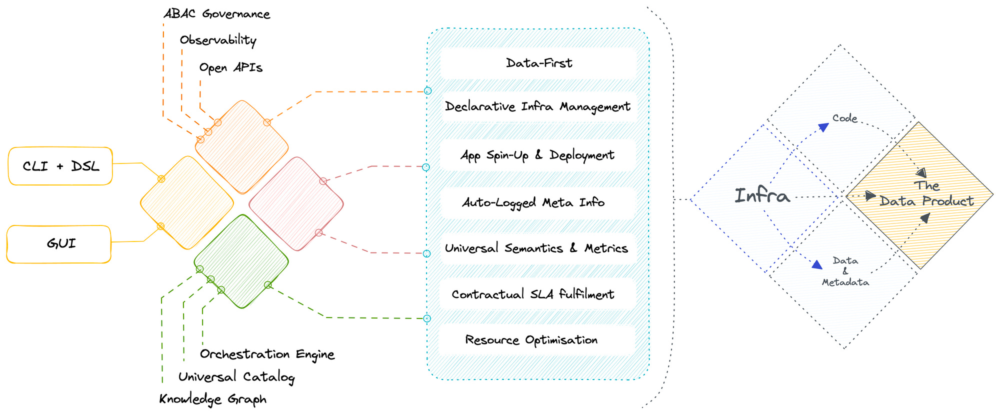

## What is Data Developer Platform

A Data Developer Platform is a Unified Infrastructure Specification to abstract complex and distributed subsystems and offer a consistent outcome-first experience to non-expert end users. A Data Developer Platform (DDP) can be thought of as an internal developer platform (IDP) for data engineers and data scientists. Just as an IDP provides a set of tools and services to help developers build and deploy applications more easily, a DDP provides a set of tools and services to help data professionals manage and analyze data more effectively.

A DDP typically includes tools for data integration, processing, storage, and analysis, as well as governance and monitoring features to ensure that data is managed, compliant and secure. The platform may also provide a set of APIs and SDKs to enable developers to build custom applications and services on top of the platform. The primary value add of a DDP lies in its unification ability- instead of having to manage multiple integrations and overlapping features of those integrations, a data engineer can breathe easy with a clean and single point of management.

In analogy to IDP, a DDP is designed to provide data professionals with a set of building blocks that they can use to build data products, services, and data applications more quickly and efficiently. By providing a unified and standardised platform for managing data, a data developer platform can help organizations make better use of their data assets and drive business value.

## Guiding Principles Behind DDP

When you build a product, you build it with a purpose in mind. The Data Developer Platform specification was also similarly designed with a set of principles guiding development since ideation. The entire DDP spec sticks to these core guidelines:

### Data-Product-First or Product Thinking

To establish DDP, the first step is to develop a product mindset and understand that data itself is a product. Establishing the product mindset is, in fact, the largest barrier in the data economy. However, unlike prevalent practices, data must be managed as a product to leverage optimal business value and incur minimal loss.

While there is no technology barrier to treating data as a product, there is also no unique tech that could claim to be its ideal implementation. This is because imbibing a product mindset in the data economy is more of a cultural challenge. However, DDP as a specification comes along with templatised processes and practices that guide data teams with the meandering journey of establishing the culture of product mindset and consequently materialising data products as a result within weeks instead of months and years.

#### **Data Stack as a Product**

Such a product mindset led to a unified architecture, which is the backbone of DDP. On the contrary, assembled systems were developed as a collection of sidecars, each one solving an ad-hoc requirement. Every sidecar or point tool came with its own product philosophy, semantics, and capabilities which, over time, clashed with the capabilities of other point tools. So when these tools were assembled together, the data stack was not a product but a messy web; quite far from the merits of a product approach. Any user who used the assembled stack tumbled into the dark trenches of duplicated and misdirected effort, overwhelming change management, and inadequate data operationalisation.

On the other hand, unified systems approach the data stack as a product right from initiation. Any ad-hoc problem is managed not by adding clashing sidecars but by combining fundamental building blocks of the unified architecture, which have common philosophies and semantics and no overlapping capabilities. Moreover, extensibility is not compromised in this approach. Data developers can still bring in point tools, but when they plug them into the unified infra, their primary capability is identified and propagated across the data stack instead of these tools operating in silos.

If we take the same example we used [here](./why_ddp_for_data.md), in assembled systems, two different catalogs and policy engines would be created, operating in silos within the compatible product philosophy of each tool. Whereas, in unified systems, the cataloguing tool would gain visibility of policies for discoverability in the governance tool, and the governance tool would be able to extend policies to the catalog items. This becomes possible due to an **interoperable interface developed on top of the unified architecture**, essentially eliminating dual catalogs and governance engines.

#### Data as a Product

Data behaves like a product when it becomes discoverable, addressable, accessible, governable, easy to understand, and in sync with the quality requirements and goals of its consumers. If the data stack itself is a collection of ad-hoc overlapping tools put together to enable the above (governance, observability, discoverability, etc.), over time, the overlap of capabilities results in multiple catalogs, governance engines, discrepant monitors, and parallel efforts to maintain the promised data experience.

Not surprisingly, this design breaks over time and the promise of experiencing data as a product is broken. Overlap of tools results in high technical debt, duplicate and corrupt data, incomprehensible metadata, and consequently multiple maintenance tickets dumped on unfortunate data engineering teams. There is practically no time to focus on the data itself because the leaky cauldron requires fixing before the stew can be perfected. Governance and observability become afterthoughts, and maintenance goes up on the priority list.

To truly enable the experience of data as a product, these capabilities need to be embedded as part of the product itself instead of being added as sidecars. The unified architecture makes this feasible by collapsing conflicting capabilities, progressively eliminating debt, and enabling data developers to focus on data for a change instead of burning hours on plumbing. 

### Software Principles for Data

DDP is built as a programmable data platform which encapsulates the low-level data infrastructure and enables data developers to shift from build mode to operate mode with state-of-the-art developer experience. DDP achieves this through running infrastructure-as-code (IaC). Developers can create and deploy config files or new resources and declaratively provision, deploy, and manage them. For instance, provisioning RDS through IaC.

Data developers could control data pipelines through a single workload specification or single window of change management, customize high-level abstractions on a need basis, use lean CLI integrations they are familiar with, and overall experience software-like robustness through importable code, prompting interfaces with smart recommendations, and on-the-fly debugging capabilities.

DDP approaches data as software and wraps code systematically to enable object-oriented capabilities such as abstraction, encapsulation, modularity, inheritance, and polymorphism across all the components of the data stack. CRUD operations on data and data artefacts follow the software development lifecycle undergoing review cycles, continuous testing, quality assurance, post-deployment monitoring and end-to-end observability. This enables reusability and extensibility of infra artefacts and data assets, enabling the data product paradigm.

Data as a product is a subset of the data-as-a-software paradigm wherein data inherently behaves like a product when managed like a software product, and the system is able to serve data products on the fly. This approach enables high clarity into downstream and upstream impact, along with the flexibility to zoom in and modify modular components.

## What is the tangible outcome of a DDP

A data developer platform establishes a flexible infrastructure to materialise desired data solutions and a plethora of data design patterns on top of its infrastructure. These design patterns are essentially frameworks that sit on top of data orchestrated by the DDP. A DDP’s job is to ensure the data is reliable and of the required data quality- enter **Data Products**.

> *Data Product brings product thinking and software development principles to the data domain, allowing data experts to accelerate value creation and delivery. Data Product empowers developers by streamlining the creation process, eliminating duplication of assets and efforts, and enabling rapid iteration and experimentation.*
> 

A Data Developer Platform enabling the Data Product Construct

The idea of “Data Products” holds significant value since it enables the key pillars of obligatory data requirements: Discoverable, Addressable, Understandable, Native accessible, Trustworthy, Interoperable, Independent, and Secure.

| Attribute | Description |
| --- | --- |
| Discoverable | A Data Product must be easy to find. |
| Addressable | A Data Product must be easy to refer to across the data ecosystem. |
| Understandable | A Data Product must be easy to comprehend & consume. |
| Natively Accessible | A Data Product must be easy to operate on with pre-existing tools and processes in the domain that users (domain citizens) are already comfortable with. |
| Trustworthy | A Data Product must guarantee the quality and authenticity of the data it presents. |
| Interoperable | A Data Product must be able to network with other data products and resources from across the data stack. |
| Independent | A Data Product must be self-contained and valuable on its own, and the data it presents should serve a purpose. |
| Secure | A Data Product must be guarded against bad actors, human or machine, throughout its journey in the data stack. |

There are multiple ways to build a data product depending on the organisation’s philosophy and approach to technology. One might choose to implement a data mesh pattern, while another might go for a data fabric. Some might discard either of the above to build a minimum viable data product pattern that works for their specific use cases. A DDP inherently furnishes a **minimum viable pattern** to enable the Data Product construct. Let's look at the definition of a data product to understand how DDP materialises it.

A Data Product is a fundamental architectural unit of a data stack, and it has three components:

1. Data & Metadata
2. Code or Instructions
3. Infrastructure

### What is a Data Product?

A Data Product is a fundamental and independent unit of your data stack that encompasses all the resources, instructions, metadata and data to serve a specific business purpose.

**Data Product Components and How DDP enables each**

To become an independent unit, a Data Product needs to wrap three structural components:

### **Code or Instructions**

The code required for data management is far from simple or straightforward. It encompasses data pipelines (ingestion, transformation, and serving), APIs (access, metadata, and metrics), and enforcement (policies, compliances, lineage & provenance). The reason why the data ecosystem is not as robust as the software ecosystem is that code for data management was never approached from a software development angle. In prevalent data stacks, all these code components are isolated and are unable to talk to each other.

> 🔑 We do not just suffer from data silos, but there’s a much deeper problem. We also suffer from data code silos.
> 

DDP approaches data as software and wraps **all code in one place** to enable object-oriented capabilities such as abstraction, encapsulation, modularity, inheritance, and polymorphism across all the components of the data stack. Most importantly, this enables complete isolation and independence for the Data Product unit. The instructions not only run the data lifecycle but also orchestrate the lifecycles of different resources in the DDP infrastructure.

Developers can experience state-of-the-art devX when it comes to code through standardised configurations, templates for scale, familiar CLI and DSL, coding prompts, importable libraries, and much more. In addition to that, becoming data-first within weeks becomes possible through the composable resources of DDP that are directed by the code in each Data Product as necessary.

### **Data & Metadata**

Data is undeniably powerless without metadata. The Data Product construct understands this and augments heterogeneous sources to tap into rich metadata. While each source and integration come with unique semantic specifications, DDP allows the data product to converge and maintain universal semantics.

> 🔑 Universal semantics allows the data product to become addressable, discoverable, interoperable, and natively accessible.
> 

This makes it possible to identify associations between data assets, surface lineage, provenance, observability metrics, and key relations across the data ecosystem, be it a native DDP resource or a foreign third-party tool. It also enables the discovery of latent information, and with open APIs, users can augment and leverage both data and metadata programmatically. With access to rich metadata, data developers can throw more light on ‘[dark data’](https://www.gartner.com/en/information-technology/glossary/dark-data) (rich yet dormant information limited by subpar semantics) and resurrect it from the trenches. 

DDP enables high-definition metadata through a central control plane that has complete visibility across the data ecosystem and is able to oversee metadata from heterogenous polyglot sources. Data contracts as one of the key resources in DDP, add life. to the metadata. A data contract is nothing but strongly typed metadata + enforcement. Implementing a contract inherently means establishing declarative enforcement. Contracts can either pull metadata from the central plane or be explicitly defined, and once established, they act as a guarantee on the specifications and make change management practically seamless.

### **Infrastructure**

The infrastructure is the foundation on which data products are built and deployed. While having dedicated data product owners and platform developers becomes essential to produce and maintain data products in a regular setting, the DDP infrastructure frees the organisation or data teams from the additional friction of onboarding, training, and maintaining infrastructure or platform teams.

The DDP Infrastructure is unified, self-serve, abstracts complex and distributed subsystems, omits excessive integration and maintenance overload, and encapsulates building blocks of a data product while maintaining customisation flexibility to offer a consistent outcome-first experience for both expert and non-expert end users.

A unified Infrastructure, as one might assume at first glance, is not an exercise of tying together multiple tools with disparate capabilities together. This goes against the primary principle of having a unified foundation. Instead, a unified infra is built upon a common set of first-order solutions, or building blocks, that are composed together to build higher-order complex solutions. Such composability is made possible by building and running **Infrastructure as Code**.

> Examples of first-order solutions: Storage, Compute, Workflow, Policy, Volume, Cluster, etc.Examples of higher-order solutions: Security, Quality, Ingestion, Transformation, Streaming, etc.
> 

The Unified Data Architecture was predicted and recommended way back in 2020, which is over three years ago. However, it largely did not get any immediate action or saw many aligned initiatives to bring the idea to fruition at scale. That has changed with the DDP specification, which embodies the unified architecture and delivers its promised benefits.

Components or Capabilities of a Unified Infrastructure | Courtesy of [a16z](https://a16z.com/2020/10/15/emerging-architectures-for-modern-data-infrastructure/)

The unified infrastructure is future-proof in the sense that it is able to implement a wide range of design patterns, including the latest mesh, due to the availability of low-level building blocks.

> The fundamentals don’t change nearly as fast as the latest tech de jour. Focus on what doesn’t change and build from there. ~ *Joe Reis, Author of Fundamentals of Data Engineering*
> 

#### The Data Product MVP and Higher Order Solutions

A bare minimum DDP enables the infrastructure for data products, while a higher-order DDP comes with minimalistic templates for code and design frameworks. Plugging in data to a DDP allows it to capture and embed metadata and eventually serve data that checks off the requirements of a data product. DDP’s unified infrastructure and data-first approach is inherently the minimal viable pattern for a data product.

However, the story doesn’t end at that. Every organisation comes with its own approach to data, and it might so happen that they are not happy with a base pattern. The good news is they don’t have to start from scratch. Architects can easily build higher-order patterns on top of DDP resources, which are **atomic non-negotiable units of any data stack**, identified and embedded as part of the DDP and orchestrated through the unified architecture.

Once an architect or data engineer has access to low-level resources, they can compose them together to manifest higher-order complex designs such as those of data mesh, data fabric, and even further higher-order patterns such as CDPs and customer 360s- all of which are designed and aimed at serving valuable data products when and where needed.

### **What does a Data Product  look like on DDP**

Broadly Data Product definition can be broken down into four aspects - Input, Transformation, SLOs and Output. Along with these, the user will have to create specs and makefile.

.png)

Edit image- generalise.

1. Input
    
    The input aspect of a Data Product focuses on the technical mechanisms for data access or ingestion, such as APIs, streaming, connectors, and batch processes. These components enable the Data Product to acquire data from various sources, ensuring seamless and reliable data flow into the system for further processing and analysis. **DDP Depots and APIs are supported mechanisms along with support for third-party tools like ADF, Fivetran etc.**
    
2. Transformation
    
    The transformation aspect of a Data Product involves the processing and manipulating of data within the product. This may include data cleansing, enrichment, aggregation, normalisation, or any other data transformations required to make the valuable data for analysis and consumption, which meets the desired format, structure, and quality. **Transformation is defined using DDP Native-Stacks and Operators that integrate third-party tools like DBT, DB notebooks etc.**
    
3. SLOs 
    
    SLOs define the performance, availability, accessibility, and quality targets a Data Product aims to achieve. These objectives ensure that the Data Product meets the required service levels regarding quality and governance. SLOs may include metrics defined on business, metadata and operations data.  Monitoring and managing SLOs help ensure that the Data Product performs optimally and meets the expectations of its consumers. **SLOs are defined using DDP resources like quality, policy, alerts, monitors and metrics.**
    
4. Output
    
    The output aspect of a Data Product refers to the results or outcomes generated from the data analysis and processing. This includes the table, stream, APIs, visualisations, or web app delivered to the data consumers. **DDP Depots, APIs, Streamlit Applications, JDBC ports etc., are supported.** 
    
5. Spec File
    
    The spec file outlines technical details such as identification, domain, versioning, intent, objectives, and SLOs for the Data Product. It is a reference and guide for developing, deploying, and maintaining the product to ensure alignment with requirements.
    

#### Sample

[https://github.com/tmdc-io/dataproduct-sample](https://github.com/tmdc-io/dataproduct-sample)

## Summarising: Conceptual Philosophy of a Data Developer Platform

A data developer platform’s philosophy is a direct parallel of the Operating System philosophy. Yes, the idea which literally changed the world by giving encapsulated technology into the hands of the masses.

While a gamer uses a Mac to run games, an accountant uses the same machine to process heavy Excel files. While a musician uses a phone to create complex media files, a grandparent uses it to video call the grandkids.

> Same platform. Different use cases.
> 
> 
> Same infrastructure. Variety of simple and complex solutions.
> 

In all cases, neither of the users needs to understand the low-level technology or build their applications from scratch to start using the applications for their desired outcomes. But does that mean there’s no one on the other end figuring out the infrastructure complexities of the laptops, PCs, and phones?

There indeed is a very small (compared to the size of the user base) team behind infrastructure building and maintenance, and their job is to ensure all the users on the other side have a seamless experience without the need to get into the nitty-gritty. If the infrastructure is well-kept, users are abstracted from the pains of booting, maintaining, and running the low-level nuances of day-to-day applications that directly bring them value.

So is the case with a well-designed data developer platform. While smaller dedicated platform teams manage and regulate the infrastructure, larger teams of data developers are able to focus their time and effort on building data applications instead of worrying about plumbing issues. Applications across a broad range, including AI/ML, data sharing, and analytics, are all enabled at scale through the virtue of the same philosophy.

With a DDP in place, the data developer is essentially abstracted from all the low-lying details- all now delegated to the unified infrastructure of the DDP. The only job of the data developer now is to build and enable data applications that directly power business value. And while the infrastructure takes care of the resources, environments, provisioning, and supervisory activities, a small dedicated platform team ensures that the infra is healthy and ready to do its job.
